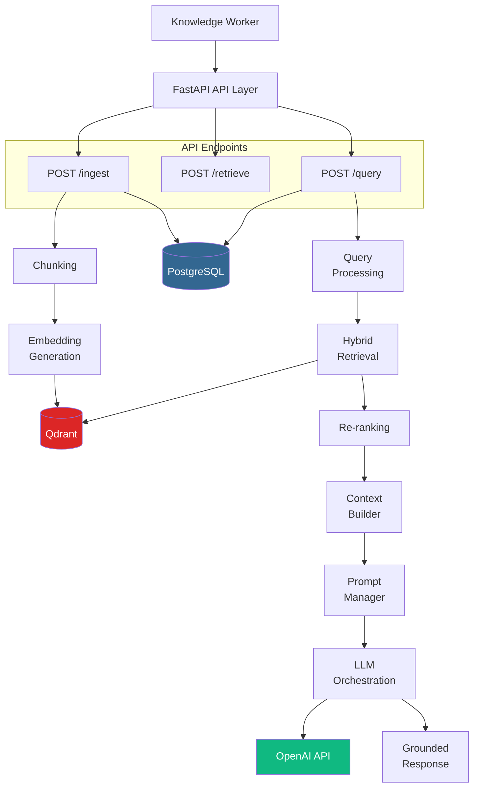
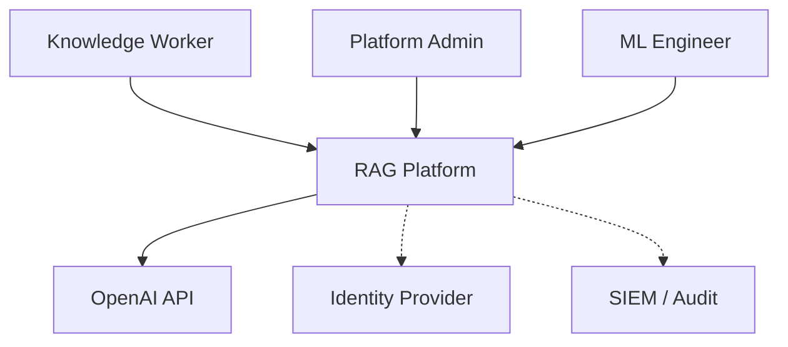
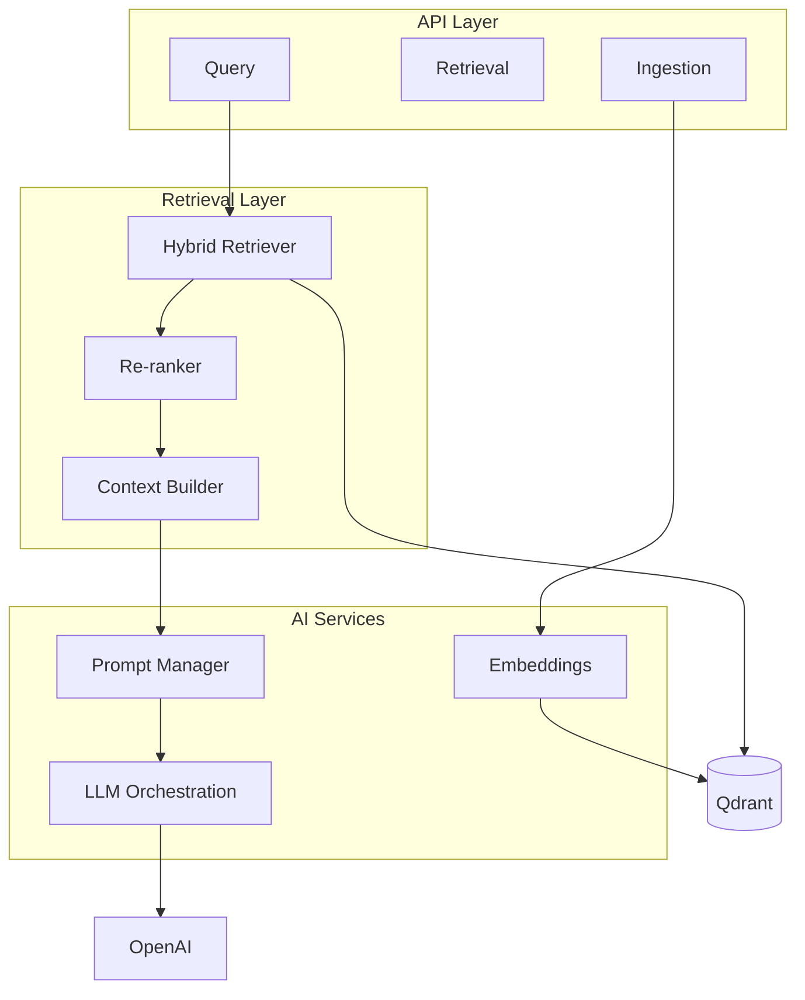
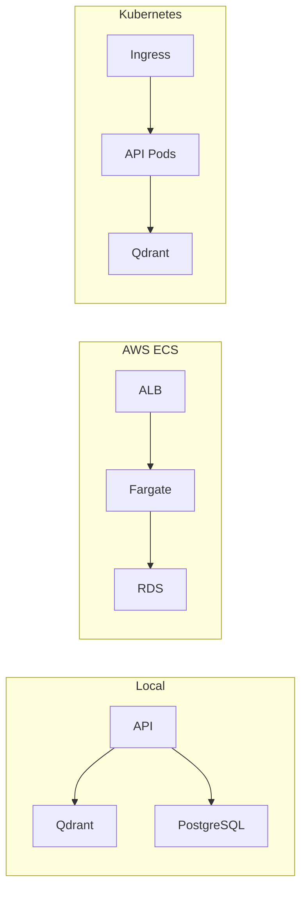
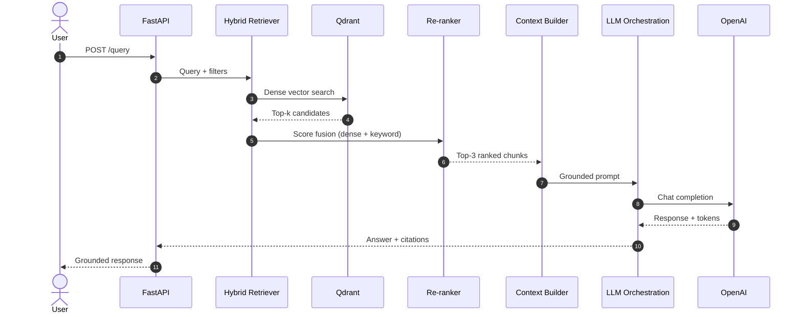
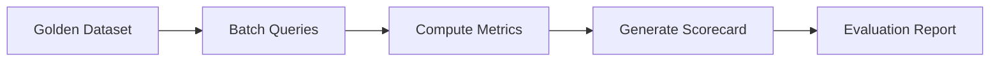
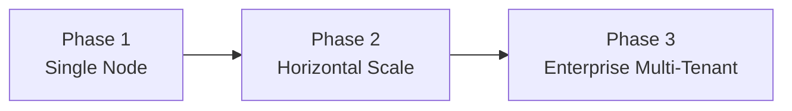

# AI RAG Reference Architecture

> A production-style reference implementation showcasing enterprise RAG platform design, AI orchestration, and engineering leadership — built for architects, not tutorials.

[](LICENSE)
[](https://www.python.org/downloads/)
[](https://fastapi.tiangolo.com/)

---

## Executive Summary

This repository presents a **reference architecture for a Retrieval-Augmented Generation (RAG) platform** — the kind of system a Head of Engineering or AI Platform Architect would design, document, and socialise across an organisation.

It is intentionally **not a production deployment**. It is a **portfolio-grade artefact** that demonstrates:

- How to architect a RAG platform with clear separation of concerns
- How to make and document technology trade-offs (ADRs)
- How to design for security, scalability, and cost from day one
- How to build an evaluation framework before scaling retrieval or prompts
- How to ship minimal, readable code that mirrors production patterns

The codebase implements five endpoints. The documentation implements the other 95%.

---

## Business Problem

Enterprise knowledge is fragmented across wikis, runbooks, policy documents, and tribal knowledge. Traditional search returns links, not answers. Raw LLM chatbots hallucinate and cannot cite sources.

**RAG solves this** by retrieving relevant documents at query time and grounding LLM responses in verified context — but building a RAG platform that is secure, observable, evaluable, and scalable requires deliberate architecture, not a Jupyter notebook.

This reference architecture addresses the question: *"How would an experienced platform team design and document a RAG system?"*

---

## Solution Overview

A layered RAG platform with:

| Layer | Responsibility |
|-------|---------------|
| **API** | Ingestion, retrieval, and full query endpoints |
| **Query Processing** | Normalisation, validation, metadata filter construction |
| **Retrieval** | Hybrid dense + keyword search with re-ranking |
| **Context Builder** | Structured context assembly with source attribution |
| **LLM Orchestration** | Prompt management, OpenAI completion, cost tracking |
| **Storage** | Qdrant (vectors) + PostgreSQL (metadata & audit) |
| **Evaluation** | Seven-dimension quality framework with scorecards |

---

## Architecture Overview



See [docs/architecture.md](docs/architecture.md) for the full architecture document.

---

## Key Components

### Document Ingestion (`POST /api/v1/ingest`)

Accepts documents, applies recursive chunking (512 tokens, 64 overlap), generates embeddings via OpenAI, and stores vectors in Qdrant with metadata payloads.

### Hybrid Retrieval (`POST /api/v1/retrieve`)

Executes dense vector search with optional metadata filters, applies keyword score fusion, and returns ranked chunks — without invoking the LLM.

### Full RAG Query (`POST /api/v1/query`)

End-to-end pipeline: retrieve → re-rank → build context → generate grounded response with source citations, latency tracking, and cost estimation.

### Evaluation Framework (`app/evaluation/`)

Automated metrics for context relevance, faithfulness, groundedness, retrieval accuracy, latency, and cost — with scorecard generation.

---

## Technology Stack

| Category | Technology | Role |
|----------|-----------|------|
| API | FastAPI | Async REST API with OpenAPI docs |
| AI Orchestration | LangChain | Text splitting, OpenAI integration |
| LLM | OpenAI (gpt-4o-mini) | Response generation |
| Embeddings | OpenAI (text-embedding-3-small) | Vector generation |
| Vector DB | Qdrant | Similarity search + payload filtering |
| Metadata | PostgreSQL | Document registry, audit logs, evaluation |
| Containers | Docker + Compose | Local dev and deployment format |
| Observability | Prometheus + OpenTelemetry | Metrics and tracing (optional) |

---

## Architecture Diagrams

### System Context



Source: [`diagrams/system-context.mmd`](diagrams/system-context.mmd)

### Component Diagram



Source: [`diagrams/component-diagram.mmd`](diagrams/component-diagram.mmd)

### Deployment Topology



Source: [`diagrams/deployment-diagram.mmd`](diagrams/deployment-diagram.mmd)

---

## Retrieval Flow



**Hybrid retrieval** combines dense vector similarity (70%) with keyword token overlap (30%). See [ADR-003](architecture-decision-records/adr-003-retrieval-strategy.md).

---

## Evaluation Strategy

Seven quality dimensions with automated scoring:

| Dimension | Threshold | Target |
|-----------|-----------|--------|
| Context Relevance | ≥ 0.75 | 0.85 |
| Answer Relevance | ≥ 0.80 | 0.90 |
| Faithfulness | ≥ 0.85 | 0.95 |
| Groundedness | ≥ 0.80 | 0.90 |
| Latency P95 | ≤ 3000ms | 1500ms |
| Cost per Query | ≤ $0.05 | $0.02 |
| Retrieval Accuracy@3 | ≥ 0.70 | 0.85 |



Full framework: [docs/evaluation-framework.md](docs/evaluation-framework.md) | Sample data: [examples/](examples/)

---

## Security Considerations

Enterprise-grade security thinking documented across:

- **Prompt injection** — input sanitisation, context delimiters, system prompt hardening
- **Data leakage** — metadata filtering, tenant isolation, minimum-necessary retrieval
- **Secrets management** — environment variables (local) → Secrets Manager (production)
- **API security** — Pydantic validation, TLS, OIDC (production path)
- **Rate limiting** — tiered limits to prevent cost explosion
- **RBAC** — role-to-collection mapping with JWT claims
- **PII handling** — detection at ingest, classification tags, output redaction

Full document: [docs/security-considerations.md](docs/security-considerations.md)

---

## Scalability Strategy

Three evolution phases without architectural rewrites:

| Phase | Topology | Capacity |
|-------|----------|----------|
| **Current** | Single-node Docker Compose | ~50 users, 10K chunks |
| **Growth** | Kubernetes + HPA + embedding workers | ~2K users, 1M chunks |
| **Enterprise** | Multi-tenant, multi-region, observability | 10K+ users, 100M+ chunks |



Full strategy: [docs/scalability-strategy.md](docs/scalability-strategy.md)

---

## Deployment Options

| Option | Use Case | Guide |
|--------|----------|-------|
| Docker Compose | Local development | [Quick Start](#local-setup) |
| AWS ECS/Fargate | Managed containers | [Deployment Guide](docs/deployment-guide.md#option-2-aws-ecs--fargate) |
| Kubernetes | Multi-cloud | [Deployment Guide](docs/deployment-guide.md#option-3-kubernetes-generic) |
| AWS EKS | Enterprise AWS | [Deployment Guide](docs/deployment-guide.md#option-4-aws-eks) |

---

## Architecture Trade-Offs and Design Decisions

> *Why a Head of Engineering chose this stack.*

| Decision | Choice | Rationale |
|----------|--------|-----------|
| Vector DB | **Qdrant** | Payload filtering for enterprise access patterns; self-hosted + managed options |
| Orchestration | **LangChain** (selective) | Industry-standard abstractions; used for splitting and OpenAI integration only |
| Metadata | **PostgreSQL** | ACID audit trails, JSONB flexibility, operational familiarity |
| API | **FastAPI** | Async I/O, automatic OpenAPI, Pydantic validation, Python ML ecosystem |
| Containers | **Docker** | Reproducible environments, deploy-anywhere portability |

Full analysis: [docs/design-decisions.md](docs/design-decisions.md)

Architecture Decision Records:
- [ADR-001: Vector Database — Qdrant](architecture-decision-records/adr-001-vector-db.md)
- [ADR-002: Chunking Strategy](architecture-decision-records/adr-002-chunking-strategy.md)
- [ADR-003: Retrieval Strategy](architecture-decision-records/adr-003-retrieval-strategy.md)
- [ADR-004: Evaluation Approach](architecture-decision-records/adr-004-evaluation-approach.md)

---

## Local Setup

### Prerequisites

- Docker Desktop or Docker Engine 24+
- Docker Compose v2
- OpenAI API key

### Quick Start

```bash
# Clone
git clone https://github.com/your-org/ai-rag-reference-architecture.git
cd ai-rag-reference-architecture

# Configure
cp .env.example .env
# Edit .env — set OPENAI_API_KEY

# Start
docker compose up -d

# Verify
curl http://localhost:8000/health
```

### Ingest Sample Documents

```bash
# Ingest platform handbook
curl -X POST http://localhost:8000/api/v1/ingest \
  -H "Content-Type: application/json" \
  -d "$(jq -n \
    --arg content "$(cat examples/sample_documents/platform-handbook.md)" \
    '{document_id: "platform-handbook", title: "Platform Engineering Handbook", source: "engineering-handbook", content: $content}')"

# Ingest RAG overview
curl -X POST http://localhost:8000/api/v1/ingest \
  -H "Content-Type: application/json" \
  -d "$(jq -n \
    --arg content "$(cat examples/sample_documents/rag-overview.md)" \
    '{document_id: "rag-overview", title: "RAG Architecture Overview", source: "architecture-docs", content: $content}')"
```

### Query

```bash
curl -X POST http://localhost:8000/api/v1/query \
  -H "Content-Type: application/json" \
  -d '{"question": "What orchestration platform does the engineering team use?"}'
```

### API Documentation

Interactive docs available at [http://localhost:8000/docs](http://localhost:8000/docs)

### Optional: Observability

```bash
docker compose --profile observability up -d
# Prometheus: http://localhost:9090
# Metrics endpoint: http://localhost:8000/metrics
```

---

## Repository Structure

```
ai-rag-reference-architecture/
├── README.md                          # This file
├── docs/                              # Architecture documentation
│   ├── architecture.md
│   ├── design-decisions.md
│   ├── deployment-guide.md
│   ├── evaluation-framework.md
│   ├── security-considerations.md
│   ├── scalability-strategy.md
│   └── cost-optimization.md
├── diagrams/                          # Mermaid diagram sources
├── architecture-decision-records/     # ADRs
├── app/                               # Application code
│   ├── api/                           # FastAPI routes & schemas
│   ├── services/                      # Chunking, prompts, LLM, database
│   ├── rag/                           # Retrieval, context, Qdrant
│   ├── embeddings/                    # Embedding generation
│   └── evaluation/                    # Quality metrics
├── examples/                          # Sample data for testing
├── docker/                            # Dockerfile & init scripts
└── docker-compose.yml
```

---

## Future Enhancements

| Enhancement | Priority | Description |
|-------------|----------|-------------|
| Authentication (OIDC) | P0 | API gateway integration with JWT |
| Cross-encoder re-ranking | P1 | Higher retrieval precision |
| Semantic chunking | P1 | Structure-aware document splitting |
| Parent-child retrieval | P2 | Small chunks for search, large for context |
| Multi-tenant collections | P2 | Per-tenant Qdrant isolation |
| Streaming responses | P2 | Server-sent events for LLM output |
| RAGAS integration | P3 | Production-grade evaluation library |
| Agent workflows (LangGraph) | P3 | Multi-step reasoning with tool use |

---

## Documentation Index

| Document | Description |
|----------|-------------|
| [Architecture](docs/architecture.md) | Full system architecture |
| [Design Decisions](docs/design-decisions.md) | Technology trade-offs |
| [Deployment Guide](docs/deployment-guide.md) | Local, ECS, K8s, EKS |
| [Evaluation Framework](docs/evaluation-framework.md) | Quality metrics & scorecards |
| [Security](docs/security-considerations.md) | Enterprise security model |
| [Scalability](docs/scalability-strategy.md) | Growth & enterprise scaling |
| [Cost Optimization](docs/cost-optimization.md) | Platform economics |

---

## License

MIT License — see [LICENSE](LICENSE).

---

<p align="center">
  Built as a reference architecture for AI platform engineering leadership.<br/>
  Documentation first. Code intentionally minimal. Patterns production-oriented.
</p>
