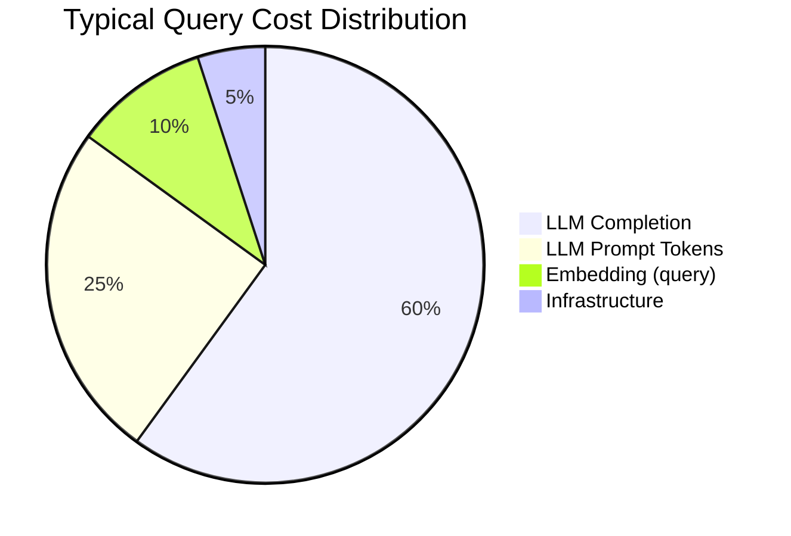

# Cost Optimization

## Overview

AI platform costs scale with usage — embedding generation, vector storage, and LLM completions each contribute to per-query economics. This document outlines cost drivers and optimization strategies across deployment phases.

## Cost Breakdown per Query



| Component | Typical Cost | Optimization Lever |
|-----------|-------------|-------------------|
| LLM completion | $0.005-0.020 | Smaller model, shorter responses |
| LLM prompt (context) | $0.002-0.010 | Reduce rerank_top_k, compress context |
| Query embedding | $0.0001 | Batch embeddings, cache frequent queries |
| Infrastructure | $0.001-0.005 | Right-size containers, spot instances |

**Target:** ≤ $0.02 per query at steady state

---

## Embedding Cost Optimization

### Model Selection

| Model | Cost (per 1M tokens) | Dimensions | Use Case |
|-------|----------------------|------------|----------|
| text-embedding-3-small | $0.02 | 1536 | Default — best cost/quality |
| text-embedding-3-large | $0.13 | 3072 | Higher accuracy needs |
| text-embedding-ada-002 | $0.10 | 1536 | Legacy — avoid |

**Decision:** `text-embedding-3-small` for reference architecture.

### Batch Processing

- Batch up to 100 chunks per embedding API call
- Async worker queue for ingestion (decouple from API)
- Deduplicate embeddings via content hash before API call

### Caching

- Cache query embeddings for repeated/similar queries (Redis, TTL 1 hour)
- Expected cache hit rate: 15-30% for FAQ-style workloads

---

## LLM Cost Optimization

### Model Selection

| Model | Input (per 1M) | Output (per 1M) | Quality | Use Case |
|-------|----------------|-----------------|---------|----------|
| gpt-4o-mini | $0.15 | $0.60 | Good | Default queries |
| gpt-4o | $2.50 | $10.00 | Best | Complex reasoning |
| gpt-3.5-turbo | $0.50 | $1.50 | Adequate | Legacy — avoid |

**Decision:** `gpt-4o-mini` for reference architecture. Route complex queries to gpt-4o via classification (future).

### Context Window Management

| Parameter | Current | Optimized |
|-----------|---------|-----------|
| retrieval_top_k | 5 | 5 (keep) |
| rerank_top_k | 3 | 3 (keep) |
| Max context tokens | ~2000 | ~1500 |
| Response max tokens | 500 | 300 (for factual queries) |

**Impact:** Reducing context from 2000 to 1500 tokens saves ~25% on prompt cost.

### Prompt Compression

- Remove redundant whitespace from context chunks
- Use structured context format (not verbose prose)
- Consider context summarization for large retrievals (future)

---

## Vector Storage Cost

### Qdrant Sizing

| Scale | Chunks | Storage (est.) | Qdrant Tier |
|-------|--------|----------------|-------------|
| Dev | 10K | ~100 MB | Docker local |
| Growth | 1M | ~10 GB | Single node |
| Enterprise | 100M | ~1 TB | Cluster + quantization |

### Quantization

Enable scalar quantization in Qdrant for 4x storage reduction with <5% accuracy loss:

```python
# Future configuration
quantization_config = ScalarQuantization(
    scalar=ScalarQuantizationConfig(type=ScalarType.INT8)
)
```

---

## Infrastructure Cost

### Local Development

| Service | Cost |
|---------|------|
| Docker Compose | Free |
| OpenAI API | ~$1-5/day active development |

### AWS ECS/Fargate (Estimated Monthly)

| Service | Spec | Cost |
|---------|------|------|
| Fargate (API) | 2 tasks, 0.5 vCPU, 1GB | ~$30 |
| RDS PostgreSQL | db.t3.micro | ~$15 |
| Qdrant Cloud | 1GB cluster | ~$25 |
| ALB | Standard | ~$20 |
| **Total** | | **~$90/mo** |

### Kubernetes/EKS (Estimated Monthly)

| Service | Spec | Cost |
|---------|------|------|
| EKS control plane | 1 cluster | ~$75 |
| EC2 nodes (3x t3.medium) | API + workers | ~$90 |
| RDS PostgreSQL | db.t3.small | ~$30 |
| Qdrant Cloud | 4GB cluster | ~$50 |
| **Total** | | **~$245/mo** |

---

## Cost Monitoring

### Metrics to Track

| Metric | Source | Alert Threshold |
|--------|--------|----------------|
| Cost per query | query_logs.estimated_cost_usd | > $0.05 |
| Daily OpenAI spend | OpenAI dashboard | > budget |
| Token usage trend | Prometheus | > 20% week-over-week |
| Embedding cache hit rate | Application metrics | < 10% |

### Cost Attribution

Tag every query log with:
- `tenant_id` — per-tenant cost allocation
- `model` — model-level cost breakdown
- `endpoint` — ingest vs. query cost separation

---

## Optimization Roadmap

| Priority | Optimization | Expected Savings |
|----------|-------------|-----------------|
| P0 | Use gpt-4o-mini + text-embedding-3-small | Baseline |
| P1 | Reduce rerank_top_k based on evaluation | 15-20% prompt cost |
| P1 | Batch embedding on ingestion | 30% embedding cost |
| P2 | Query embedding cache | 10-15% embedding cost |
| P2 | Qdrant quantization | 75% storage cost |
| P3 | Model routing (simple → mini, complex → 4o) | 20-40% LLM cost |
| P3 | Spot/preemptible instances for workers | 60% compute cost |

---

## Related Documents

- [Evaluation Framework](./evaluation-framework.md)
- [Scalability Strategy](./scalability-strategy.md)
- [Design Decisions](./design-decisions.md)
