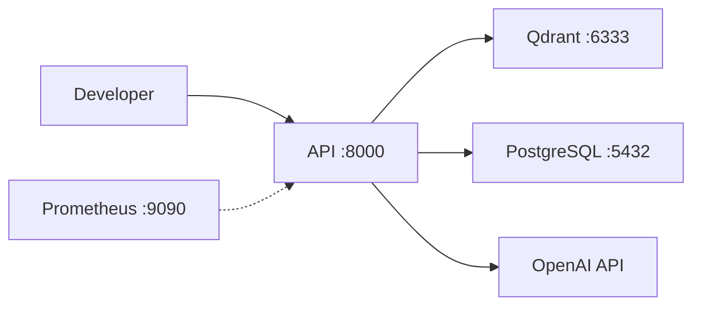
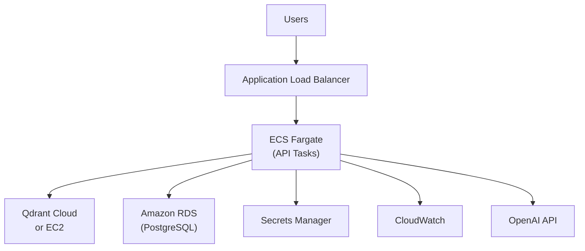
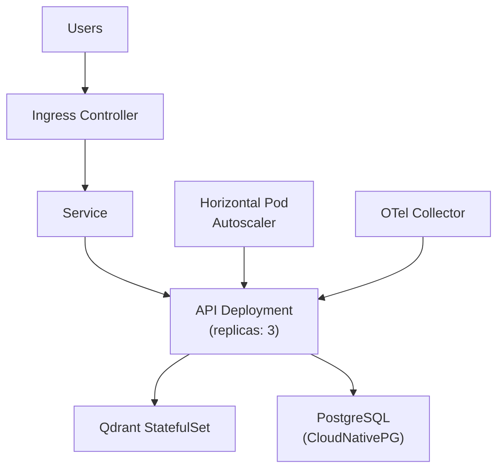
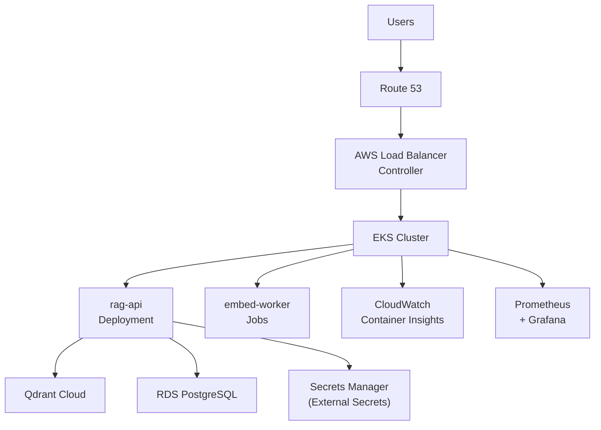

# Deployment Guide

## Overview

This guide covers four deployment topologies for the RAG platform, from local development to enterprise Kubernetes on AWS EKS.

## Deployment Options Summary

| Option | Best For | Complexity | Cost |
|--------|----------|------------|------|
| Local Docker Compose | Development, demos | Low | Free (local) |
| AWS ECS/Fargate | Managed container deployment | Medium | ~$50-200/mo |
| Kubernetes (generic) | Multi-cloud, full control | High | Variable |
| AWS EKS | Enterprise AWS-native | High | ~$150-500/mo |

---

## Option 1: Local Docker Compose

### Architecture



### Prerequisites

- Docker Desktop or Docker Engine 24+
- Docker Compose v2
- OpenAI API key

### Steps

```bash
# Clone repository
git clone https://github.com/your-org/ai-rag-reference-architecture.git
cd ai-rag-reference-architecture

# Configure environment
cp .env.example .env
# Edit .env and set OPENAI_API_KEY

# Start services
docker compose up -d

# Verify health
curl http://localhost:8000/health

# Ingest sample document
curl -X POST http://localhost:8000/api/v1/ingest \
  -H "Content-Type: application/json" \
  -d '{
    "document_id": "doc-001",
    "title": "Platform Overview",
    "source": "engineering-handbook",
    "content": "Our platform uses Kubernetes for container orchestration..."
  }'

# Query
curl -X POST http://localhost:8000/api/v1/query \
  -H "Content-Type: application/json" \
  -d '{"question": "What orchestration platform do we use?"}'
```

### Optional: Observability Profile

```bash
docker compose --profile observability up -d
# Prometheus available at http://localhost:9090
```

---

## Option 2: AWS ECS / Fargate

### Architecture



### Components

| AWS Service | Purpose |
|-------------|---------|
| ECS Fargate | Serverless container hosting for API |
| ALB | HTTPS termination, health checks, routing |
| RDS PostgreSQL | Managed metadata and audit store |
| Qdrant Cloud | Managed vector database |
| Secrets Manager | OpenAI API key, DB credentials |
| CloudWatch | Logs, metrics, alarms |
| ECR | Container image registry |

### Deployment Steps

1. **Build and push container**

```bash
aws ecr get-login-password --region us-east-1 | docker login --username AWS --password-stdin $ECR_URI
docker build -f docker/Dockerfile -t rag-platform .
docker tag rag-platform:latest $ECR_URI/rag-platform:latest
docker push $ECR_URI/rag-platform:latest
```

2. **Provision infrastructure** (Terraform/CDK recommended)
   - VPC with public/private subnets
   - RDS PostgreSQL in private subnet
   - ECS cluster with Fargate task definition
   - ALB with target group pointing to ECS service
   - Secrets Manager entries for `OPENAI_API_KEY`, DB credentials

3. **Configure task definition environment**

```json
{
  "environment": [
    {"name": "QDRANT_HOST", "value": "your-cluster.qdrant.io"},
    {"name": "POSTGRES_HOST", "value": "rag-db.xxxx.us-east-1.rds.amazonaws.com"}
  ],
  "secrets": [
    {"name": "OPENAI_API_KEY", "valueFrom": "arn:aws:secretsmanager:..."}
  ]
}
```

4. **Deploy ECS service** with desired count ≥ 2 for availability

### Scaling

- ECS Service Auto Scaling on CPU/memory
- Target: 70% CPU utilization
- Min: 2 tasks, Max: 10 tasks

---

## Option 3: Kubernetes (Generic)

### Architecture



### Key Manifests

```yaml
# deployment.yaml (abbreviated)
apiVersion: apps/v1
kind: Deployment
metadata:
  name: rag-api
spec:
  replicas: 3
  selector:
    matchLabels:
      app: rag-api
  template:
    spec:
      containers:
        - name: api
          image: rag-platform:latest
          ports:
            - containerPort: 8000
          envFrom:
            - secretRef:
                name: rag-secrets
          resources:
            requests:
              cpu: 250m
              memory: 512Mi
            limits:
              cpu: 1000m
              memory: 1Gi
          livenessProbe:
            httpGet:
              path: /health
              port: 8000
          readinessProbe:
            httpGet:
              path: /health
              port: 8000
---
apiVersion: autoscaling/v2
kind: HorizontalPodAutoscaler
metadata:
  name: rag-api-hpa
spec:
  scaleTargetRef:
    apiVersion: apps/v1
    kind: Deployment
    name: rag-api
  minReplicas: 2
  maxReplicas: 10
  metrics:
    - type: Resource
      resource:
        name: cpu
        target:
          type: Utilization
          averageUtilization: 70
```

### Dedicated Embedding Workers

For high ingest volume, deploy embedding as a separate Job/CronJob:

```yaml
apiVersion: batch/v1
kind: Job
metadata:
  name: embed-worker
spec:
  template:
    spec:
      containers:
        - name: embed-worker
          image: rag-platform:latest
          command: ["python", "-m", "app.workers.embed"]
```

---

## Option 4: AWS EKS

### Architecture



### EKS-Specific Considerations

| Concern | Recommendation |
|---------|---------------|
| Node groups | Separate pools for API (general) and workers (compute) |
| IRSA | IAM Roles for Service Accounts for AWS API access |
| External Secrets | Sync Secrets Manager → K8s secrets |
| Qdrant | Qdrant Cloud preferred; self-hosted via StatefulSet + EBS |
| Networking | Private subnets for workloads; NAT for OpenAI egress |
| Multi-AZ | RDS Multi-AZ; EKS nodes across 3 AZs |

### Deployment Pipeline

```
GitHub → CodePipeline → CodeBuild (docker build) → ECR → ArgoCD/Flux → EKS
```

---

## Environment Configuration

| Variable | Local | ECS/EKS |
|----------|-------|---------|
| `OPENAI_API_KEY` | `.env` file | Secrets Manager |
| `QDRANT_HOST` | `qdrant` (Compose) | Qdrant Cloud URL |
| `POSTGRES_HOST` | `postgres` (Compose) | RDS endpoint |
| `OTEL_ENABLED` | `false` | `true` |

## Health Checks

All deployment targets use the same health endpoint:

```
GET /health → {"status": "healthy", "qdrant": "connected", "postgres": "connected"}
GET /metrics → Prometheus metrics (when enabled)
```

## Rollback Strategy

- **ECS:** Deploy previous task definition revision
- **Kubernetes:** `kubectl rollout undo deployment/rag-api`
- **Database:** Point-in-time recovery via RDS snapshots

## Related Documents

- [Architecture Overview](./architecture.md)
- [Scalability Strategy](./scalability-strategy.md)
- [Security Considerations](./security-considerations.md)
