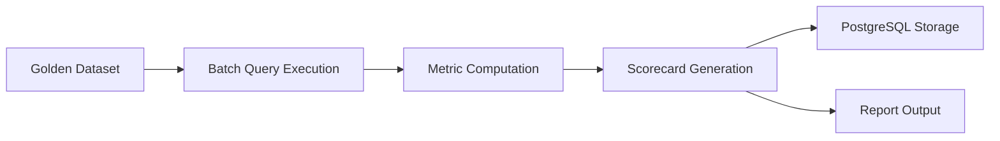

# Evaluation Framework

## Overview

RAG systems fail silently. Retrieval quality degrades, prompts drift, and model updates change behavior — often without obvious errors. This evaluation framework provides structured, repeatable quality assessment across seven dimensions.

## Evaluation Dimensions

### 1. Context Relevance

**Question:** Do the retrieved chunks address the user's query topic?

**Measurement:**
- Keyword overlap between query and retrieved chunk text
- Optional: LLM-as-judge scoring (1-5 scale)

**Formula (automated):**
```
context_relevance = avg(token_overlap(query, chunk_i)) for i in top_k
```

**Pass threshold:** ≥ 0.75

---

### 2. Answer Relevance

**Question:** Does the generated response directly answer the user's question?

**Measurement:**
- LLM-as-judge: "Rate how well this answer addresses the question (1-5)"
- Normalized to 0-1 scale

**Pass threshold:** ≥ 0.80

---

### 3. Faithfulness

**Question:** Are all claims in the answer supported by the retrieved context?

**Measurement:**
- Extract atomic claims from the answer
- Verify each claim against retrieved context (keyword/semantic match)
- Score = supported_claims / total_claims

**Pass threshold:** ≥ 0.85

---

### 4. Groundedness

**Question:** Does the response cite and use retrieved sources?

**Measurement:**
- Citation coverage: chunks referenced in response / chunks retrieved
- Source attribution present in response format

**Pass threshold:** ≥ 0.80

---

### 5. Latency

**Question:** How fast is the end-to-end query pipeline?

**Measurement:**
- P50, P95, P99 from query audit logs
- Breakdown: retrieval_ms, llm_ms, total_ms

**Pass threshold:** P95 ≤ 3000ms

---

### 6. Cost per Query

**Question:** What is the economic cost of each query?

**Measurement:**
```
cost = (prompt_tokens × input_price) + (completion_tokens × output_price) + embedding_cost
```

Reference pricing (gpt-4o-mini):
- Input: $0.15 / 1M tokens
- Output: $0.60 / 1M tokens
- Embedding (text-embedding-3-small): $0.02 / 1M tokens

**Pass threshold:** ≤ $0.05 per query

---

### 7. Retrieval Accuracy

**Question:** Is the expected source chunk retrieved in the top-k results?

**Measurement:**
- Compare retrieved chunk IDs against golden dataset expected chunks
- Accuracy@k = hits / total_queries

**Pass threshold:** Accuracy@3 ≥ 0.70

---

## Evaluation Workflow



### Step 1: Prepare Golden Dataset

Curated test cases in `examples/`:

- `sample_queries.md` — test questions
- `expected_outputs.md` — expected answers and source chunks
- `sample_documents/` — source documents for ingestion

### Step 2: Execute Batch Queries

Run each query through the full RAG pipeline and collect:
- Retrieved chunks (IDs, scores, text)
- Generated response
- Latency breakdown
- Token usage

### Step 3: Compute Metrics

Use `app/evaluation/metrics.py` to compute all seven dimensions.

### Step 4: Generate Scorecard

Aggregate results into a pass/fail scorecard with trend comparison.

---

## Sample Scorecard

```json
{
  "run_name": "baseline-v1.0",
  "timestamp": "2026-05-31T10:00:00Z",
  "sample_count": 10,
  "metrics": {
    "context_relevance": {
      "score": 0.82,
      "threshold": 0.75,
      "status": "PASS"
    },
    "answer_relevance": {
      "score": 0.88,
      "threshold": 0.80,
      "status": "PASS"
    },
    "faithfulness": {
      "score": 0.91,
      "threshold": 0.85,
      "status": "PASS"
    },
    "groundedness": {
      "score": 0.85,
      "threshold": 0.80,
      "status": "PASS"
    },
    "latency_p95_ms": {
      "score": 1850,
      "threshold": 3000,
      "status": "PASS"
    },
    "cost_per_query_usd": {
      "score": 0.012,
      "threshold": 0.05,
      "status": "PASS"
    },
    "retrieval_accuracy_at_3": {
      "score": 0.80,
      "threshold": 0.70,
      "status": "PASS"
    }
  },
  "overall_status": "PASS",
  "overall_score": 0.86
}
```

---

## Sample Evaluation Report (Markdown)

```markdown
# Evaluation Report — baseline-v1.0

**Date:** 2026-05-31
**Samples:** 10 queries
**Overall:** PASS (0.86)

## Summary

| Metric                  | Score  | Threshold | Status |
|-------------------------|--------|-----------|--------|
| Context Relevance       | 0.82   | 0.75      | PASS   |
| Answer Relevance        | 0.88   | 0.80      | PASS   |
| Faithfulness            | 0.91   | 0.85      | PASS   |
| Groundedness            | 0.85   | 0.80      | PASS   |
| Latency P95             | 1850ms | 3000ms    | PASS   |
| Cost per Query          | $0.012 | $0.05     | PASS   |
| Retrieval Accuracy@3    | 0.80   | 0.70      | PASS   |

## Failed Queries

None.

## Recommendations

1. Increase rerank_top_k from 3 to 4 for queries about deployment options
2. Add semantic chunking for the security policy document
3. Monitor faithfulness on multi-hop reasoning queries
```

---

## Per-Query Evaluation Example

**Query:** "What orchestration platform does the engineering team use?"

| Metric | Score | Notes |
|--------|-------|-------|
| Context Relevance | 0.95 | Retrieved chunk directly mentions Kubernetes |
| Answer Relevance | 0.92 | Answer states Kubernetes with context |
| Faithfulness | 1.00 | All claims supported by context |
| Groundedness | 0.90 | Cited source: engineering-handbook |
| Latency | 1420ms | retrieval: 180ms, llm: 1200ms |
| Cost | $0.008 | 850 prompt + 120 completion tokens |
| Retrieval Accuracy@3 | 1.00 | Expected chunk at rank 1 |

---

## Continuous Evaluation Strategy

| Phase | Frequency | Scope |
|-------|-----------|-------|
| Development | Every PR | Golden dataset subset (5 queries) |
| Staging | Daily | Full golden dataset |
| Production | Weekly | Sampled production queries + golden set |
| Model upgrade | Before deploy | Full golden + regression comparison |

## Related Documents

- [ADR-004: Evaluation Approach](../architecture-decision-records/adr-004-evaluation-approach.md)
- [Sample Queries](../examples/sample_queries.md)
- [Expected Outputs](../examples/expected_outputs.md)
