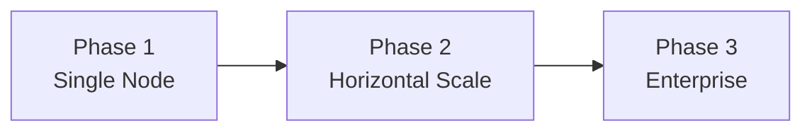
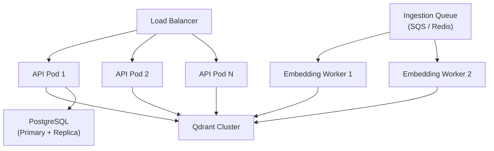
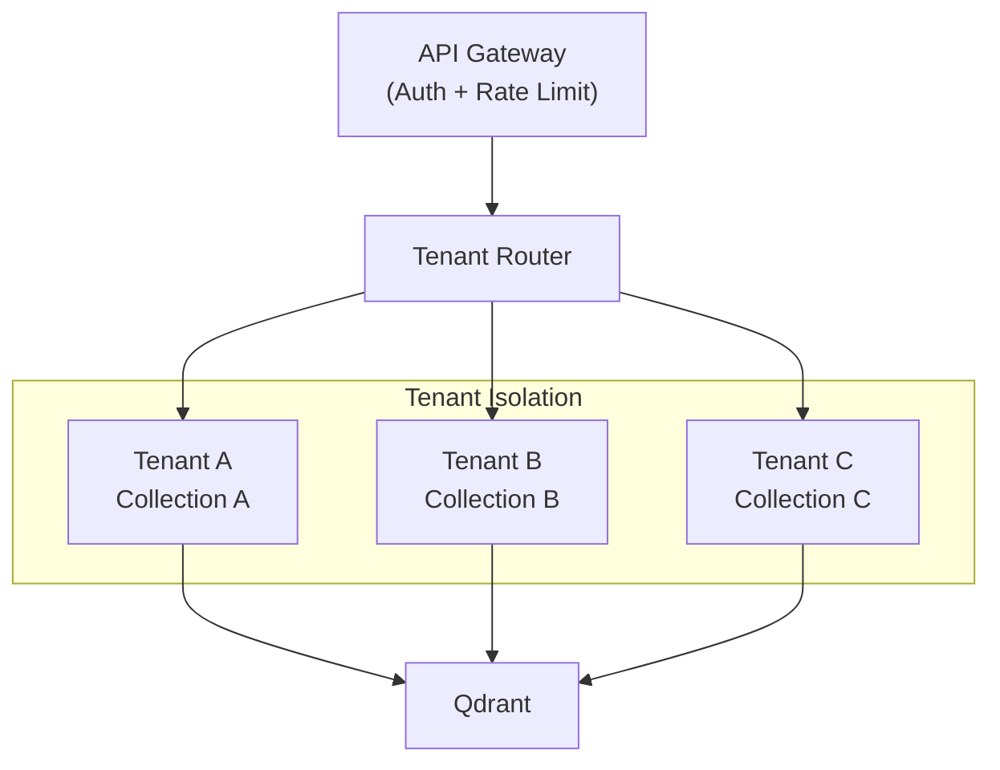

# Scalability Strategy

## Overview

This document describes the scalability evolution from single-node development to enterprise multi-tenant deployment. Each phase adds capability without requiring architectural rewrites.

## Scalability Phases



---

## Phase 1: Current Design — Single Node

### Topology

```
Docker Compose
├── API (1 instance)
├── Qdrant (1 instance)
└── PostgreSQL (1 instance)
```

### Characteristics

| Dimension | Capacity |
|-----------|----------|
| Concurrent users | ~10-50 |
| Documents | ~10,000 chunks |
| Queries/sec | ~5-10 |
| Ingestion | Synchronous, inline |

### Suitable For

- Development and testing
- Demos and proof-of-concept
- Small team internal knowledge base

### Limitations

- Single point of failure
- Embedding generation blocks ingestion requests
- No tenant isolation
- Limited observability

---

## Phase 2: Growth Design

### Topology



### Horizontal Scaling

| Component | Strategy |
|-----------|----------|
| API | Kubernetes Deployment with HPA (CPU/memory) |
| Qdrant | Cluster mode with sharding by collection |
| PostgreSQL | Read replicas for audit/analytics queries |
| Embedding | Dedicated worker pool decoupled from API |

### Separate Retrieval Layer

Extract retrieval into a dedicated microservice when:

- Retrieval latency dominates P95 (> 40% of total)
- Different scaling characteristics than LLM orchestration
- Multiple consumers need retrieval (search UI, RAG, recommendations)

```
API Gateway → Retrieval Service → Qdrant
           → Orchestration Service → OpenAI
```

**Benefits:**
- Independent scaling of retrieval vs. generation
- Retrieval service can be cached aggressively
- Different resource profiles (retrieval: memory-bound, LLM: I/O-bound)

### Dedicated Embedding Workers

Move embedding generation off the API critical path:

```
Ingest API → Queue → Embedding Workers → Qdrant Upsert
```

| Parameter | Value |
|-----------|-------|
| Worker concurrency | 4-8 per worker |
| Batch size | 100 chunks per embedding call |
| Retry policy | 3 attempts with exponential backoff |
| Dead letter queue | Failed chunks for manual review |

### Target Capacity (Phase 2)

| Dimension | Capacity |
|-----------|----------|
| Concurrent users | ~500-2,000 |
| Documents | ~1M chunks |
| Queries/sec | ~50-100 |
| Ingestion | Async, 10K docs/hour |

---

## Phase 3: Enterprise Design

### Multi-Tenant Architecture



| Isolation Level | Implementation |
|----------------|---------------|
| Collection per tenant | Qdrant separate collections |
| Metadata filtering | Payload filter on every query |
| Network isolation | VPC per tenant (strictest) |
| Encryption | Per-tenant encryption keys (CMK) |

### Regional Deployment

For global enterprises with data residency requirements:

```
US-East: API + Qdrant + PostgreSQL (US data)
EU-West: API + Qdrant + PostgreSQL (EU data)
AP-South: API + Qdrant + PostgreSQL (APAC data)
```

- Route users to nearest region via GeoDNS
- No cross-region data replication (data sovereignty)
- Shared evaluation framework with region-local golden datasets

### Observability Layer

| Component | Purpose |
|-----------|---------|
| OpenTelemetry | Distributed tracing across services |
| Prometheus | Metrics collection (latency, error rate, cost) |
| Grafana | Dashboards and alerting |
| Structured logging | JSON logs with correlation IDs |

**Key dashboards:**
- Query latency (P50/P95/P99) by endpoint
- Retrieval accuracy trend
- Cost per query trend
- Error rate by tenant
- Embedding queue depth

**Alerting thresholds:**
- P95 latency > 5s for 5 minutes
- Error rate > 1% for 5 minutes
- Cost per query > $0.10 (anomaly detection)
- Qdrant disk usage > 80%

### Target Capacity (Phase 3)

| Dimension | Capacity |
|-----------|----------|
| Tenants | 100+ |
| Concurrent users | 10,000+ |
| Documents | 100M+ chunks |
| Queries/sec | 1,000+ |
| Regions | 3+ |

---

## Scaling Decision Matrix

| Signal | Action |
|--------|--------|
| API CPU > 70% sustained | Scale API replicas |
| P95 latency > 3s, retrieval > 40% | Extract retrieval service |
| Ingestion backlog growing | Add embedding workers |
| Single Qdrant node at capacity | Qdrant cluster mode |
| PostgreSQL connections exhausted | Add PgBouncer + read replicas |
| Multi-team adoption | Implement tenant isolation |
| Data residency requirements | Regional deployment |

---

## Related Documents

- [Deployment Guide](./deployment-guide.md)
- [Cost Optimization](./cost-optimization.md)
- [Architecture Overview](./architecture.md)
